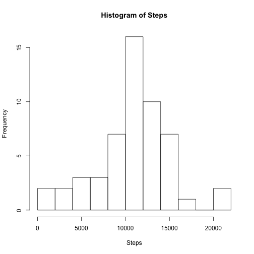
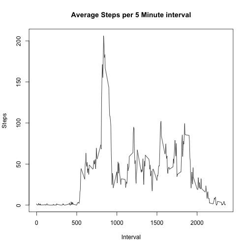
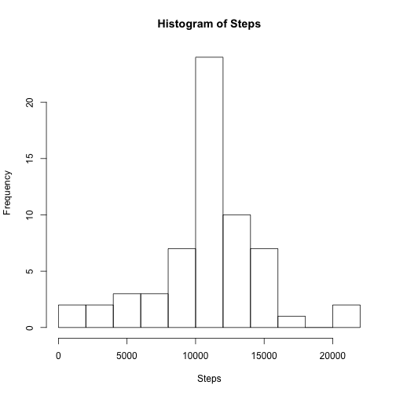
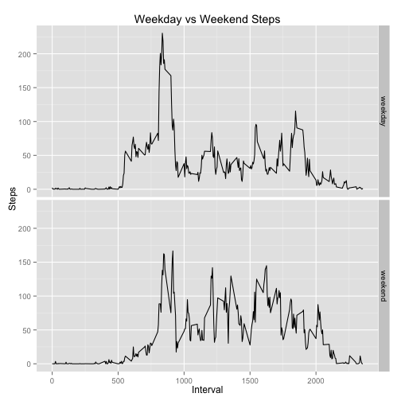

## Loading and preprocessing the data

This code loads the data set, and ggplot2 package, since one of the plots will be done with the qplot function.  No preprocessing is done, since the cleaning required depends upon the question asked.  


```r
library(ggplot2)

activity = read.csv("activity.csv")
```


## What is mean total number of steps taken per day?

For this question, we will ignore NA values.  stepsPerDay aggregates the total steps taken for each particular day.


```r
stepsPerDay = with(activity[!(is.na(activity$steps)),],aggregate(steps,list(date),sum))
names(stepsPerDay) = c("Date","Steps")
meanSteps = mean(stepsPerDay$Steps)
medSteps = median(stepsPerDay$Steps)
```

Here is a histogram of the steps taken per day:


```r
with(stepsPerDay,hist(Steps,breaks=seq(1,floor(max(Steps)/1000)*1000 + 2000,2000)))
```

 

The mean number of steps taken per day is 1.0766189 &times; 10<sup>4</sup>, and the median is 10765.


## What is the average daily activity pattern?

To find the average daily activity pattern, stepsPerInterval aggregates the average number of steps taken across all days by each 5 minute interval.  


```r
stepsPerInterval = with(activity[!(is.na(activity$steps)),],aggregate(steps,list(interval),mean))
names(stepsPerInterval) = c("Interval","Steps")
maxStepsInterval = with(stepsPerInterval,Interval[which.max(Steps)])
```

Here is a timseries plot of the results:


```r
with(stepsPerInterval,plot(Interval,Steps,type="l",main="Average Steps per 5 Minute interval"))
```

 

The 5 minute interval containing the maximum average number of steps is 835.  

## Imputing missing values

This code imputes the missing values.  Values are imputed by using the mean value for the corresponding five minute interal across all days.  It appears as though the missing values are found in full day blocks (ie the whole day is missing).  Therefore we would expect that days with missing values will exactly represent the average, and that the histogram with imputed values will regress towards the mean. 


```r
missingValuesCount = (dim(activity) - dim(activity[complete.cases(activity),]))[1]
imputedActivity = activity
imputedActivity$meanSteps = sapply(activity$interval,function(x){stepsPerInterval$Steps[stepsPerInterval$Interval == x]})
imputedActivity$steps[is.na(imputedActivity$steps)] = imputedActivity$meanSteps[is.na(imputedActivity$steps)]
imputedActivity = imputedActivity[,c(1,2,3)]

imputedStepsPerDay = with(imputedActivity,aggregate(steps,list(date),sum))
names(imputedStepsPerDay) = c("Date","Steps")
imputedMeanSteps = mean(imputedStepsPerDay$Steps)
imputedMedSteps = median(imputedStepsPerDay$Steps)
```

Here is a histogram of the results:


```r
with(imputedStepsPerDay,hist(Steps,breaks=seq(1,floor(max(Steps)/1000)*1000 + 2000,2000)))
```

 

As suspected, this histogram resembles the previous histogram, but is more concentrated at the mean.  Additionally, the mean steps per day 1.0766189 &times; 10<sup>4</sup> and the median steps per day 1.0766189 &times; 10<sup>4</sup> are the same.  This makes sense, because we added full days that were missing, essentially guaranteeing that the mean steps per day from the previous data set is now an actual value in the data set, and is represented more than once.  The mean and median were already so close that the imputed data pushed the median to the mean.  The mean has also not changed from the previous value of 1.0766189 &times; 10<sup>4</sup>, which makes sense because the only values we added represented the mean, which would not move the mean.

## Are there differences in activity patterns between weekdays and weekends?

The code below does the same as the analysis for the daily activity pattern above, except it classifies and separates days by "weekday" or "weekend", and aggregates the results by both five minute interval and daytype.


```r
dayofweek = sapply(as.Date(imputedActivity$date),weekdays)
imputedActivity$daytype =  as.factor(as.vector(
    sapply(dayofweek,function(x){ifelse(x %in% c("Saturday","Sunday"),"weekend","weekday")})))

intervalsByDaytype = with(imputedActivity,aggregate(steps,list(interval,daytype),mean))
names(intervalsByDaytype) = c("Interval","Daytype","Steps")
```

Here is a timseries comparison of a typical weekday and a typical weekend:


```r
print(qplot(Interval,Steps,data=intervalsByDaytype,facets=Daytype~.,geom="line",main="Weekday vs Weekend Steps"))
```

 
